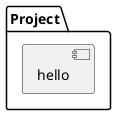

# Project design

Describe the design of your project: what components it has, what each component 
is responsible for, how the components interact, and how they work. Also describe the required data and the output that is generated.

UML diagrams written as text in a `plantuml` block are automaticallly rendered when the
documentation is built.

## Components

The package has one component name `hello`.

## Behaviour

The `hello` component prints "Hello World".

```plantuml
@startuml
left to right direction
(*) --> "print"
"print" --> (*)
@enduml
```

